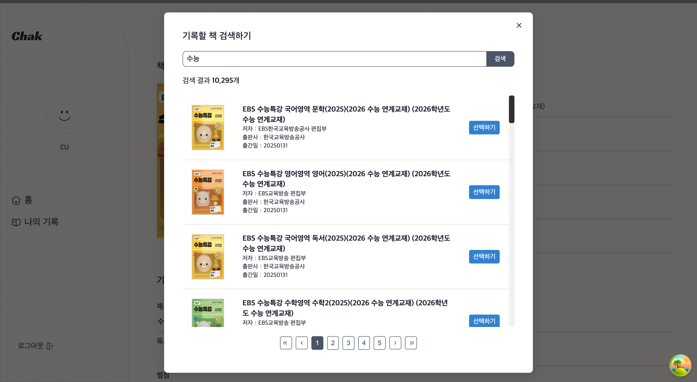

## 📖 독서 기록 플랫폼 **Chak** ✅ (클라이언트)

### [배포 화면 보러가기 🚀🚀 ](https://chak-client.vercel.app)

## 📌 소개

 
재밌게 읽은 책이여도 책을 덮는 순간 금세 기억이 흐릿해집니다.
Chak은 책과 관련된 기록을 쉽게 작성하고 확인할 수 있도록 도와줍니다.

## 🛠 사용된 기술

| **용도**                          | **기술**                                      |
| --------------------------------- | --------------------------------------------- |
| **코어**                          | TypeScript, React 19, Next.js 15 (App Router) |
| **데이터 통신 및 서버 상태 관리** | Axios, React Query                            |
| **폼 컨트롤 및 데이터 검증**      | React Hook Form, Zod                          |
| **스타일링**                      | CSS, Vanilla Extract                          |
| **배포**                          | Vercel                                        |

## ✨ 구현 기능

### ✅ 인증

| 회원가입                                                                   | 로그인                                                                  |
| -------------------------------------------------------------------------- | ----------------------------------------------------------------------- |
|  |  |

- **React Hook Form**과 **Zod**를 결합하여 간결하게 폼을 컨트롤하고 데이터 유효성 검증 진행
- API 응답 상태를 Toast UI로 사용자에게 상태 전달 (사용성 개선??)
- **AuthGuard**를 통해 로그인 하지 않은 사용자는 로그인 페이지로 리다이렉션함.
- **XSS** 공격에 대응하기 위해 토큰을 **HttpOnly 쿠키**로 세팅함.
   
  🚨 서버 사이드에서 API 요청 시 브라우저 쿠키에 저장된 인증 토큰이 전달되지 않는 이슈 발생.
  - (원인) 쿠키 도메인이 API 서버이기 때문에 넥스트 앱에서 요청이 발생해도 쿠키가 포함되지 않음. 따라서 넥스트 서버에서 클라이언트에 저장된 쿠키에 접근할 수 없음.
  - (해결) API 서버에서 토큰을 전달받은 후 넥스트 app route에서 토큰을 쿠키에 세팅. API 요청 시 넥스트 미들웨어에서 토큰을 추가한 후 API 서버로 요청.

### 📚 독서 기록 CRUD

| 목록                                                                             | 상세                                                                               |
| -------------------------------------------------------------------------------- | ---------------------------------------------------------------------------------- |
|  |  |

| 생성                                                                            | 수정                                                                             |
| ------------------------------------------------------------------------------- | -------------------------------------------------------------------------------- |
|  |  |

- API를 통한 독서 기록 조회, 생성, 수정, 삭제 기능 구현
- 넥스트 App Router에서의 **SSR** 지원
   
  🚨 페이지 라우팅 시 반응이 0.5초 정도 느려지는 현상 발생.
  - (원인) 서버에서 SSR이 완료된 후 페이지가 이동되기 때문에 반응 속도가 느려짐.
  - (해결) **Loading** 컴포넌트와 **withSuspense** HOC로 페이지를 스트리밍하여 라우팅 속도 개선.

### 📄 데이터 노출

| 페이지네이션                                                                  | 무한 스크롤                                                                       |
| ----------------------------------------------------------------------------- | --------------------------------------------------------------------------------- |
|  |  |

- 성능 최적화와 사용성 개선을 위한 데이터 페이징 구현
- 쿼리 파라미터에서 page 값을 가져와 독서 기록 조회 API를 호출하여 페이지네이션 구현
- **React Query**에서 제공하는 **useInfiniteQuery**와 **React Intersection Observer** 라이브러리를 사용하여 무한 스크롤 구현

| 데이터 필터링                                                                    | 책 검색                                                                              |
| -------------------------------------------------------------------------------- | ------------------------------------------------------------------------------------ |
|  |  |

- **독서 기록 필터링**

  - 독서 상태에 따른 독서 기록 데이터 필터링 구현

- **책 검색**
  - 독서 기록 생성 시 책 정보 추가를 위한 책 검색 기능 제공
  - 네이버 쇼핑 API를 통해 불러온 책 검색 결과 노출
  - 사용자가 일일이 책 정보를 기입하지 않아도 되도록 책 선택하기 버튼 클릭 시 독서 기록표에 책 정보 자동 기입

## 📷 리소스 저작권

- **프로필 기본 이미지**:  
  <a href='https://pngtree.com/freepng/smile-vector-template-design-illustration_3997111.html'>png image from pngtree.com</a>
